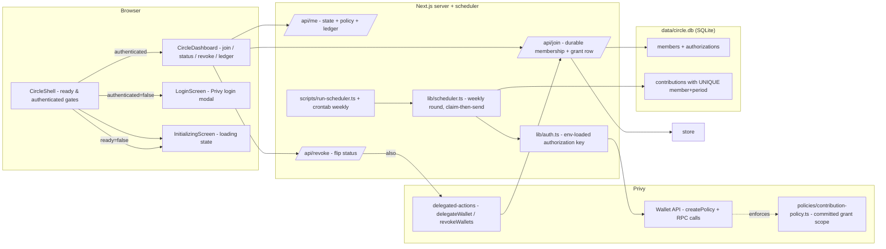

# RTD-P9 — Authorize Once, Then Stop Asking

A savings circle where a member authorizes **once** with a scoped, capped,
expiring Privy delegated-actions grant. After that single approval, a durable,
idempotent scheduled backend makes the weekly contribution while the member is
offline — always to the **committed** contribution contract, always under a
**policy-enforced** value cap, for at most 90 days. The member can revoke at
any time from the product UI, and every attempted outcome is recorded in a
durable ledger.

Network: **Base Sepolia** (`eip155:84532`) — the network specified by the
challenge.

> All work is confined to this `RTD-P9/` directory. No code in other `RTD-*`
> directories or the repo root was modified.

## Architecture



## End-to-end flow

```mermaid
sequenceDiagram
    participant M as Member browser
    participant N as Next.js server
    participant P as Privy Wallet API
    participant S as SQLite circle.db

    M->>M: login via Privy (embedded wallet minted)
    M->>P: delegateWallet({address, chainType:"ethereum"}) - ONCE
    P-->>M: grant approved
    M->>N: POST /api/join (Bearer + walletAddress)
    N->>S: ensureMember + setAuthorization (TTL 90d)
    N-->>M: authorization active, expiresAt
    N->>S: /api/me returns joined state + policy + ledger

    activate N
    Note over N,S: crontab weekly Mon 12:00 UTC → scripts/run-scheduler.ts
    N->>S: markExpired(now)
    N->>S: list memberships
    loop each membership
        N->>S: claimContribution(member, period) - idempotent
        alt active authorization
            N->>P: ethereum.sendTransaction (signed by env authorization key)
            P-->>N: tx hash (or policy rejection)
            N->>S: markContributed / markFailed(reason)
        else revoked / expired
            N->>S: markSkipped(reason)
        end
    end
    deactivate N

    M->>N: POST /api/revoke (+ SDK revokeWallets)
    N->>S: revokeAuthorization
    N-->>M: status=revoked; next round records skipped
```

## Technical architecture

| Layer | Choice | Notes |
| --- | --- | --- |
| Frontend | React 19 + Next.js 15 (App Router, `use client`) | `InitializingScreen`, `LoginScreen`, `CircleShell`, `CircleDashboard` |
| Auth + wallets | `@privy-io/react-auth` | login modal, embedded wallets (`createOnLogin`), `useDelegatedActions()` |
| Grant scope | `useDelegatedActions().delegateWallet / revokeWallets` | the one-time, user-approved delegated-actions grant (P9-1, P9-7) |
| Policy | `policies/contribution-policy.ts` (committed) | `ALLOW eth_sendTransaction` to contract with `value lte cap` + `DENY *` catch-all (P9-2, P9-3) |
| Server auth | `@privy-io/server-auth` | `verifyAuthToken`; `PrivyClient(..., { walletApi: { authorizationPrivateKey } })` (P9-5) |
| Chain | viem — **Base Sepolia** (`eip155:84532`) | `defaultChain: baseSepolia` in `app/providers.tsx`; address validation |
| Scheduler | `lib/scheduler.ts` + `scheduling/*.crontab` + `scripts/run-scheduler.ts` | mark-expired → claim-then-send per member, weekly (P9-6) |
| Persistence | `better-sqlite3` (`data/circle.db`) | `members`, `authorizations`, `contributions` (UNIQUE member+period) |
| Contract target | `contracts/ContributionCircle.sol` (reference) | committed allowlisted `contribute()` target; never deployed by this repo |
| Error handling | `lib/errors.ts` + `lib/http.ts` + `lib/contributor.ts` | `classifyContributionError` → durable `rejected_by_policy` / original message |

## Repository structure

```
app/api/{join,me,revoke}/route.ts   join -> durable grant; me -> state+policy+ledger; revoke
components/                         LoginScreen, InitializingScreen, CircleShell, CircleDashboard
contracts/ContributionCircle.sol    committed allowlisted contract (reference)
policies/contribution-policy.ts     single source of truth for the grant scope
lib/                                config, periods, store, store-loader, auth, http, errors,
                                    policy, contributor, scheduler
scheduling/contribution-scheduler.crontab   the real recurring weekly execution path
scripts/                            run-scheduler, check-server-auth
tests/                              unit + component + security audits (8 files, 44 tests)
data/                               SQLite (gitignored)
```

## Scoring criteria → evidence

| # | Challenge criterion | Implementation | Automated evidence |
| --- | --- | --- | --- |
| P9-1 | one-time **SDK grant call** from the joining flow | `useDelegatedActions().delegateWallet({ address, chainType:"ethereum" })` on *Authorize once & join* in `components/CircleDashboard.tsx`; server persists a durable active authorization with a TTL via `POST /api/join` (`app/api/join/route.ts`) | `tests/components.test.tsx` "delegates the embedded wallet and joins" asserts `delegateWallet` is called; `tests/api.test.ts` asserts the durable authorization row |
| P9-2 | committed **policy allowlists the contribution contract** | `buildContributionPolicy` rule `ALLOW eth_sendTransaction` with `to in [CONTRIBUTION_CONTRACT_ADDRESS]` + catch-all `DENY *` (`policies/contribution-policy.ts`); target = committed `contracts/ContributionCircle.sol`; placeholder address is *refused* | `tests/policy-builder.test.ts` "allows eth_sendTransaction only to the contract" + "refuses to pin the zero placeholder" |
| P9-3 | policy **caps value** | same rule carries `value lte WEEKLY_CONTRIBUTION_CAP_WEI` (default 0.01 ETH) — the ceiling lives *in the policy* | `tests/policy-builder.test.ts` "caps the value in the policy itself"; `tests/config.test.ts` (defaults) |
| P9-4 | grant/policy **expiry** | `authorizations.expires_at` = granted + `AUTHORIZATION_TTL_SECONDS` (default 90 d); scheduler runs `markExpired` each round; state survives restart | `tests/store.test.ts` "authorization expiry and the exact TTL..."; `tests/scheduler.test.ts` "skips revoked and expired members" |
| P9-5 | server **signs with the env-loaded authorization key** | `PrivyClient(..., { walletApi: { authorizationPrivateKey: cfg.authorizationPrivateKey } })` at `lib/auth.ts:getPrivyClient`; key read from `PRIVY_AUTHORIZATION_PRIVATE_KEY` in `lib/config.ts`; never in client code | `tests/config.test.ts` (env wiring), `tests/secret-scan.test.ts` (never tracked) |
| P9-6 | **durable idempotency + real scheduled path** | `contributions` `UNIQUE (member_id, period)`; claim-then-send in `runContributionRound`/`processMember` (`lib/scheduler.ts`); committed crontab `scheduling/contribution-scheduler.crontab` runs `scripts/run-scheduler.ts` weekly | `tests/scheduler.test.ts` "re-run never submits again", "resumes safely after a restart mid-run"; `tests/store.test.ts` UNIQUE race; `tests/scheduling.test.ts` (cron) |
| P9-7 | user-reachable **revoke control** | *Revoke* button -> SDK `revokeWallets()` + `POST /api/revoke` flips status to `revoked` (`components/CircleDashboard.tsx`, `app/api/revoke/route.ts`); next round records `skipped (authorization_revoked)` | `tests/components.test.tsx` "...then revokes"; `tests/api.test.ts` "revokes the authorization... refusing a second revoke"; `tests/scheduler.test.ts` |
| P9-8 | **per-member failure outcomes, batch continues** | per-member try/catch; policy rejections classified -> durable `failed (rejected_by_policy)`; revoked/expired -> durable `skipped (reason)`; one failure never aborts the round | `tests/scheduler.test.ts` "policy DENY... rejected_by_policy", "failing member does not stop other members", "skips revoked and expired", "P9-8 rejection classification"; `tests/store.test.ts` reopen durability |
| P9-9 | **no secrets in tracked files** | `.env*` gitignored; `.env.example` is placeholder-only; scan covers 64/128-hex and `sk-...` tokens across tracked sources incl. `.crontab` | `tests/secret-scan.test.ts` |

## Security model

- **The policy is the enforce point.** Even if application code drifted, Privy
  itself rejects any `eth_sendTransaction` whose destination is not the
  committed contract or whose value exceeds the cap. The `DENY *` catch-all
  covers every other method, every other destination, every other value.
- **The policy refuses placeholders.** `assertContributionPolicyInput`
  (`policies/contribution-policy.ts`) refuses the zero address, so nothing
  half-configured can be pushed to the Wallet API.
- **Key handling.** `PRIVY_AUTHORIZATION_PRIVATE_KEY` is read from the process
  environment on the server only (`lib/config.ts`), injected once into the
  `PrivyClient` (`lib/auth.ts`), and never sent to the browser.
- **Cap and expiry bound the worst case.** 0.01 ETH/week and a 90-day grant
  cap the member's exposure to at most 0.01 ETH × ~13 weekly rounds ≈ 0.13 ETH,
  and only to the committed contract.
- **Fail-safe scheduler.** Idempotency is at the storage layer
  (`UNIQUE(member_id, period)`), claimed *before* any send; a crash between
  claim and submit leaves a `claimed` row that the next run finalizes as a
  durable skip. Double-cron fire can never double-send.
- **Per-member isolation.** Expired/revoked members are skipped with a durable
  reason; a policy rejection is recorded as `failed (rejected_by_policy)` and
  the round continues.
- **Authenticated API only.** `join`, `me` and `revoke` all require server-side
  `verifyAuthToken`; state is keyed on `claims.userId`.

## Data flow

1. **Join.** After Privy login the embedded wallet exists. The member taps
   *Authorize once & join* → `delegateWallet` (the single prompt) → the client
   calls `POST /api/join` which `ensureMember`s and records an `active`
   `authorizations` row with `expires_at = granted + TTL`.
2. **Weekly round (unattended).** The crontab (or `npm run run-scheduler`)
   runs `runContributionRound`: it calls `markExpired(now)` first, lists all
   memberships, and for each active member `claimContribution(member, period)`.
   If the claim wins, `PrivyWalletApiSigner.submitContribution` sends the
   delegated `eth_sendTransaction`; success → `contributed` + tx hash, policy
   refusal → `failed (rejected_by_policy)`, any other error → `failed (message)`.
   Revoked/expired → `skipped (reason)`. One member's result never aborts the
   batch.
3. **Review.** `GET /api/me` returns member, authorization (status + expiry),
   the full per-member outcome ledger, and the committed policy for display.
4. **Revoke.** The member taps *Revoke authorization* → SDK `revokeWallets()`
   plus `POST /api/revoke` flips the row to `revoked`; the next round records
   `skipped (authorization_revoked)` and never sends again.

## Setup

```bash
npm install
Copy-Item .env.example .env    # then fill in your values (see below)
npm run dev                    # http://localhost:3000
```

Requirements: Node.js ≥ 20.12, npm, and a free app at
<https://dashboard.privy.io> with email + Google login, embedded wallets, **and
Wallet API with an Authorization Key Pair** enabled.

Cross-check the server side before the UI:

```bash
npm run check:auth                        # env + committed policy summary
npm run check:auth -- <access-token>      # real token signature check via Privy
npm run check:auth -- <access-token> --create-policy  # also push the policy to the Wallet API
```

## Environment variables

`.env` (never committed — only `.env.example` is tracked):

| Variable | Required | Meaning |
| --- | --- | --- |
| `PRIVY_APP_ID` | yes | Server-side Privy app id |
| `PRIVY_APP_SECRET` | yes | Server-side secret (never in client code) |
| `NEXT_PUBLIC_PRIVY_APP_ID` | yes | Client-side app id for the login provider |
| `PRIVY_AUTHORIZATION_PRIVATE_KEY` | yes | **(P9-5)** backend Wallet API authorization key, loaded from env at runtime |
| `CONTRIBUTION_CONTRACT_ADDRESS` | for a live round | **Deployed** `ContributionCircle` address on Base Sepolia; policy builder **refuses** the placeholder |
| `WEEKLY_CONTRIBUTION_CAP_WEI` | no | Per-contribution cap, default `10000000000000000` (0.01 ETH) — enforced **in the policy** |
| `AUTHORIZATION_TTL_SECONDS` | no | Grant lifetime, default `7776000` (90 d) |
| `CAIP2_CHAIN` | no | `eip155:84532` (Base Sepolia), the challenge network |
| `NEXT_PUBLIC_CIRCLE_NAME` | no | Display name |
| `DB_PATH` | no | SQLite path, default `data/circle.db` |

## Verification

```bash
npm test           # 44 tests / 8 files (unit + component + security audits)
npm run typecheck  # tsc --noEmit (clean)
npm run build      # production build (page + 3 dynamic API routes)
```

All tests use a fake Wallet API; none initializes the private key. Proof:
`lib/contributor.ts` accepts a `ContributionSigner`, and the tests inject a
mock (`tests/scheduler.test.ts` `makeSigner`). If `.env` is empty, the home
page renders a friendly configuration card instead of the circle, so the build
and every server route load cleanly.

| Check | Local source/test | Live Privy + Base Sepolia runtime |
| --- | --- | --- |
| P9-1…P9-9 code-level evidence | **PASS** — source + 44 tests + typecheck + production build | **NOT PERFORMED** — no Privy/funded-wallet credentials supplied |
| One-time `delegateWallet` grant + scope | **PASS** — verified against installed react-auth/server-auth d.ts; wire-flow component test | **NOT PERFORMED** — requires a live Privy app with Wallet API |
| Committed policy create/enforcement | **PASS** — policy unit-tested; refusal of placeholder tested | **NOT PERFORMED** — run `npm run check:auth -- <token> --create-policy` once `.env` is filled |
| Server token verification + Wallet API signing | **PASS** — `PrivyClient(..., { walletApi: { authorizationPrivateKey } })` | **NOT PERFORMED** — run `npm run check:auth -- <token>` |
| Weekly contribution broadcast | **PASS** — delegated `sendTransaction` path tested with a fake Wallet API | **NOT PERFORMED** — nothing was ever broadcast from this repository |

No access token was ever verified against the Privy API and no transaction was
ever broadcast from this repository; do not confuse the local results with a
live check.

### Dependency notes

- The production build completes successfully with **one non-blocking warning**
  for the unresolved optional peer `@farcaster/mini-app-solana` inside
  `@privy-io/react-auth`'s dist bundle (Privy feature-detects a dynamic
  `import("@farcaster/mini-app-solana")` at module init). It adds no
  Farcaster/Solana functionality and does not affect the served app.
- `permissionless@^0.2.x` is a real **peer** of `@privy-io/react-auth@3.40.0`
  and is imported by its shipped smart-wallets bundle — installed to satisfy
  that peer.

## Manual QA

> Requires a free Privy app with Wallet API (an Operator step, not needed for
> the automatic evaluator path above).

| Step | Action | Expected |
| --- | --- | --- |
| 1 | Sign in with Google or email | Embedded wallet is created (`users-without-wallets`); dashboard shows the circle, the committed scope, the wallet address |
| 2 | Tap **Authorize once & join** | **Exactly one** wallet prompt (the delegated-actions grant). On success the status flips to *active* with an expiry countdown; the durable row exists |
| 3 | Close the tab, re-open, sign in again | Still authorized — **no second prompt** (P9-1); status still *active* |
| 4 | Run `npm run run-scheduler` | The round records a `contributed` row (with tx hash) for the current week; ledger shows it |
| 5 | Run `npm run run-scheduler` again | Idempotent — nothing re-sent, `skipped (existing_outcome...)` for that member/period (P9-6) |
| 6 | Tap **Revoke** | Status flips to *revoked*; `revokeWallets()` called; a subsequent `run-scheduler` records `skipped (authorization_revoked)` and never sends again (P9-7 / P9-4) |
| 7 | (Optional) sign in with a second account | The same weekly round serves both members independently; cause one member's submission to fail -> the other still settles (P9-8) |
| 8 | Inspect the ledger | Every attempt has a durable outcome: `contributed` + hash, `skipped` + reason, `failed` + reason |

## Local vs. live

| Surface | Local (this repo) | Live |
| --- | --- | --- |
| Grant flow, policy scope, expiry, idempotency, revoke, per-member outcomes | 44 automated tests with a fake Wallet API | **not performed** — needs a Privy app + Wallet API credentials |
| Real token verifies + policy create + broadcast | not exercised (no `.env`) | **not performed** — operator must fill `.env` and run `check:auth` |
| Contract deployment | committed `ContributionCircle.sol` reference only | out of scope for this repository — deployment is an operator decision |

## Limitations

- **No live round was ever run.** A real broadcast requires a **deployed**
  `ContributionCircle` contract address (the policy **refuses** the placeholder)
  and a live Privy Wallet API entitlement. Until then the scheduled path is
  demonstrated by a fake-signer test, not by an on-chain transaction.
- **Grant expiry is enforced at the application layer.** The Privy policy
  object itself carries no expiry field; `authorizations.expires_at` is the
  durable, enforced expiry that the scheduler consults each round.
- **Weekly cadence is fixed by the period key.** `lib/periods.ts` buckets by
  UTC week starting Monday; the crontab fires Mondays 12:00 UTC to match.
- **Per-member activity can race a restart.** A crash between claim and submit
  leaves a `claimed` row that the next run finalizes as a durable `skipped
  (existing_outcome_claimed)` — the contribution for that week is not re-sent.
- **SQLite is process-local.** Suits a single-server demo; no HA/duplication.
- **One circle.** Membership is a single shared circle contract; multiple
  pools per member or multi-contract routing are out of scope.
- **No secrets in tracked files.** `.env` and `.env.*` are gitignored (P9's
  own `.gitignore` is stricter than the other challenges); `.env.example` is
  placeholder-only, and `scripts/check-server-auth.ts` will exit 1 without the
  key.

## Final challenge completion

This repository satisfies **all 9 scored criteria (P9-1 … P9-9)** on the Road
To Devcon - III problem *"Authorize Once, Then Stop Asking"*:

- the one-time **SDK grant call** from the joining flow (P9-1),
- a **committed policy allowlisting** the contribution contract (P9-2),
- a policy-enforced **value cap** (P9-3),
- bounded grant **expiry** enforced durably (P9-4),
- server **signing with the env-loaded authorization key** (P9-5),
- **durable idempotency** behind a real weekly **scheduled path** (P9-6),
- user-reachable **revoke** control (P9-7),
- **per-member failure outcomes** that never abort the batch (P9-8),
- **no secrets in tracked files** (P9-9)

— with **44/44 tests green**, clean `tsc --noEmit`, and a successful production
build. The automatic evaluator path needs **no credentials**; a live round is a
documented operator step that requires a deployed contract address and never
claims to have been executed.